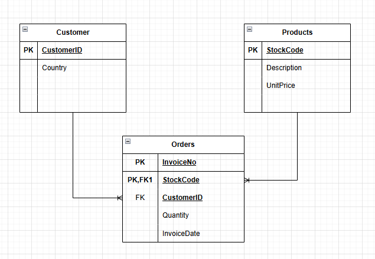

# BIS Data Processing Pipeline

This project implements a data processing pipeline using **PySpark** for big data handling and **Pydantic** for data validation. The pipeline extracts, validates, transforms, and loads customer, product, and order data.

I have created an **SQLite** database to analyze the data and provide answers to your questions.

## 📊 SQLite Data Model

- [DDLs](data\db\ddl.sql)




- [Hadoop DDLs](data\out\hadoop_ddl.sql)


## 📌 Project Structure
The project consists of the following components:

1. **Extraction (`extract.py`)**: Reads CSV files using PySpark.
2. **Validation** (`transform_customer.py`) , (`transform_order.py`) and (`transform_product.py`): Validates extracted data using Pydantic models.
3. **Transformation**: Cleans and transforms the data for further processing.
4. **Loading (`load_data.py`)**: Saves processed data in Parquet format and loads it into an SQLite database.

```bash
pip install pyspark pydantic
```


**Exercise - Top 10 countries with the most number of customers.**

``bash
Get-Content .\data\db\01_exercise_top10.sql | sqlite3 .\data\db\bis.db
``

| Country          | Customer Count |
|------------------|----------------|
| United Kingdom   | 3950           |
| Germany          | 95             |
| France           | 87             |
| Spain            | 31             |
| Belgium          | 25             |
| Switzerland      | 21             |
| Portugal         | 19             |
| Italy            | 15             |
| Finland          | 12             |
| Austria          | 11             |

**Exercise - Revenue distribution by country.**

``bash
Get-Content .\data\db\02_exercise_revenue_by_country.sql | sqlite3 .\data\db\bis.db
``

| Country                  | Total      |
|-----------------------|------------|
| United Kingdom       | 9,880,386.01 |
| Netherlands         | 503,523.86 |
| EIRE               | 327,473.65 |
| Germany            | 298,713.66 |
| France             | 274,667.98 |
| Australia          | 212,654.42 |
| Sweden             | 97,776.03 |
| Switzerland        | 72,537.21 |
| Japan              | 70,662.23 |
| Spain              | 70,587.58 |
| Belgium            | 64,152.12 |
| Norway             | 51,015.28 |
| Portugal           | 40,480.49 |
| Finland            | 26,134.95 |
| Austria            | 22,991.01 |
| Denmark            | 22,865.22 |
| Channel Islands    | 22,376.56 |
| Cyprus             | 20,142.33 |
| Italy              | 18,378.85 |
| Singapore          | 12,442.63 |
| Israel             | 9,844.53 |
| Poland             | 8,502.99 |
| Canada             | 6,983.66 |
| Iceland            | 4,843.42 |
| Unspecified        | 4,412.32 |
| Greece             | 3,692.7 |
| USA                | 2,928.92 |
| United Arab Emirates | 2,237.73 |
| Malta              | 2,130.14 |
| Lithuania          | 1,838.5 |
| European Community | 1,481.94 |
| Czech Republic     | 1,480.46 |
| Lebanon            | 1,021.13 |
| RSA                | 849.42 |
| Brazil             | 790.55 |
| Bahrain            | 519.44 |
| Saudi Arabia       | 167.58 |


**Exercise - Relationship between average unit price of products and their sales volume.**

``bash
Get-Content .\data\db\03_exercise_average_price_volumes.sql | 
sqlite3 .\data\db\bis.db
``

| Description                                | AveragePrice | TotalSalesVolume |
|-------------------------------------------|--------------|------------------|
| SMALL POPCORN HOLDER                     | 0.29         | 56450            |
| WORLD WAR 2 GLIDERS ASSTD DESIGNS        | 2.53         | 53847            |
| JUMBO BAG RED RETROSPOT                  | 4.39         | 47363            |
| WHITE HANGING HEART T-LIGHT HOLDER       | 1.29         | 38830            |
| ASSORTED COLOUR BIRD ORNAMENT           | 0.40         | 36221            |
| PACK OF 72 RETROSPOT CAKE CASES         | 3.20         | 36039            |
| RABBIT NIGHT LIGHT                      | 3.84         | 30646            |
| MINI PAINT SET VINTAGE                  | 3.76         | 26437            |
| PACK OF 12 LONDON TISSUES               | 2.87         | 26315            |
| PACK OF 60 PINK PAISLEY CAKE CASES      | 0.57         | 24753            |